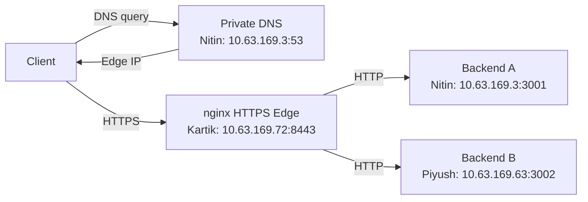

# Computer Networks Phase 1 Project

This project demonstrates private DNS, HTTPS, reverse proxying, load balancing, conditional HTTP caching and packet analysis using three physical macOS laptops on the same hotspot LAN.

The implementation and functional tests were completed on 3 October 2026. The repository contains source code, configurations, setup instructions and recorded evidence.

## 1. Team and Machine Roles

| Member | Private IP | Roles |
|---|---|---|
| Nitin Kumar | 10.63.169.3 | Private DNS server and Backend A |
| Kartik Yadav | 10.63.169.72 | nginx edge, TLS termination and load balancing |
| Piyush Yadav | 10.63.169.63 | Backend B, client testing and Wireshark capture |

**Infrastructure:** Type 2 — Three Macs with combined roles  
**Network:** Kartik's phone hotspot  
**Subnet:** 10.63.169.0/24  
**Gateway:** 10.63.169.210  
**Interface:** en0 on all three Macs

These addresses belong to the recorded setup. Recheck them before a new live demonstration.

## 2. Project Overview

The private DNS server resolves both project domains to Kartik's nginx edge:

```text
app.teamcn.test → 10.63.169.72
api.teamcn.test → 10.63.169.72
```

Clients connect to nginx through HTTPS on port `8443`. nginx terminates TLS and forwards HTTP requests to either Backend A or Backend B.



## 3. Services and Ports

| Service | Host | Port |
|---|---|---|
| Private DNS | Nitin | UDP/TCP 53 |
| Backend A | Nitin | TCP 3001 |
| Backend B | Piyush | TCP 3002 |
| nginx HTTP | Kartik | TCP 8080 |
| nginx HTTPS | Kartik | TCP 8443 |

## 4. Repository Structure

```text
CN_Project/
├── backend/
│   ├── server.py
│   ├── README.md
│   └── Validation.md
├── configs/
│   ├── dnsmasq-phase1.conf
│   ├── dnsmasq-wrong-record-demo.conf
│   ├── nginx-phase1-http.conf
│   ├── nginx-phase1-https.conf
│   ├── tls-server.cnf
│   ├── server.crt
│   ├── DNS_Setup.md
│   ├── DNS_Rollback.md
│   ├── NGINX_Setup.md
│   ├── TLS_Setup.md
│   └── TLS_Client_Trust.md
├── docs/
│   ├── Architecture.md
│   ├── Demo_Guide.md
│   ├── Progress.md
│   ├── History.md
│   ├── 03_Ping_Checks.md
│   ├── 04_Screenshot_Guide.md
│   ├── 05_Caching_Test.md
│   ├── 06_Packet_Capture.md
│   └── 07_Failure_Demonstrations.md
├── evidence/
│   ├── INDEX.md
│   ├── Phase1_DNS_TCP_TLS.pcapng
│   ├── screenshots and images
│   └── recorded terminal evidence
└── README.md
```

## 5. Start Here

| Document | Purpose |
|---|---|
| [Architecture](docs/Architecture.md) | Topology, machine roles and request flow |
| [Project Status](docs/Progress.md) | Verified results and remaining presentation work |
| [Demo Guide](docs/Demo_Guide.md) | Startup commands and demonstration sequence |
| [Evidence Index](evidence/INDEX.md) | Recorded outputs, screenshots and packet capture |

## 6. Setup Instructions

Follow these documents to reproduce the setup:

1. [Backend Setup](backend/README.md)
2. [Private DNS Setup](configs/DNS_Setup.md)
3. [TLS Certificate Setup](configs/TLS_Setup.md)
4. [nginx Setup](configs/NGINX_Setup.md)
5. [Client Certificate Trust](configs/TLS_Client_Trust.md)

Use `dnsmasq-phase1.conf` for the working DNS configuration.

Use `nginx-phase1-https.conf` as Kartik's runtime `edge/nginx.conf`. The HTTP-only configuration records the initial routing setup.

The wrong-record DNS file is reserved for the failure demonstration.

## 7. Backend Endpoints

Both backends use the same Python standard-library server.

| Endpoint | Response |
|---|---|
| `/` | Service message, backend identifier and status |
| `/api/status` | Backend identifier and status |
| `/api/cache` | Shared cacheable JSON resource |

The `X-Backend` header identifies the backend serving each response.

The status endpoints use `Cache-Control: no-store`. The cache endpoint returns `Cache-Control: public, max-age=60` and an ETag.

## 8. Verified Phase 1 Results

| Requirement | Result |
|---|---|
| LAN connectivity | All six directional ping tests passed with zero packet loss |
| Private DNS | Both domains resolved correctly from two configured clients |
| Backend services | Both backends returned HTTP 200 with correct identifiers |
| Reverse proxy | nginx forwarded requests to the backend services |
| Load balancing | Repeated requests returned responses from both A and B |
| HTTPS | Certificate verification passed on all three Macs |
| Conditional caching | HTTP 200 followed by matching HTTP 304 without a body |
| Packet analysis | DNS, TCP and TLS exchanges verified in the original capture |

The initial HTTP test included timeouts. A later repeat succeeded; the original delay's cause was not conclusively established.

## 9. HTTPS Verification

Kartik and Piyush used the private DNS server and trusted the project certificate.

```bash
curl -v --connect-timeout 5 --max-time 15 \
  https://app.teamcn.test:8443/api/status
```

Recorded tests negotiated TLS 1.3, verified the certificate hostname and returned HTTP 200.

Nitin used `--resolve` without changing his system DNS. His test verified HTTPS connectivity and certificate trust, rather than default DNS resolution.

The private key remains on Kartik's Mac. Only the public certificate is included in the repository.

## 10. Caching Demonstration

Piyush tested:

```text
https://app.teamcn.test:8443/api/cache
```

The initial response came from Backend B with HTTP 200, Cache-Control and an ETag.

A request containing the matching If-None-Match value returned HTTP 304 from Backend A without a body.

This demonstrates conditional validation across both backends. nginx proxy caching was not configured.

See [Caching Test](docs/05_Caching_Test.md).

## 11. Wireshark Evidence

The original capture contains 41 packets, with zero dropped packets reported by Wireshark.

Verified packets include:

- DNS query and response: frames 15 and 16
- TCP three-way handshake: frames 21–23
- TLS Client Hello: frame 24
- Server Hello and Certificate: frame 27
- Encrypted Application Data: frames 33 and 35

TLS 1.2 was deliberately selected for this capture. Ordinary HTTPS tests negotiated TLS 1.3.

See [Packet Capture Analysis](docs/06_Packet_Capture.md) and the [Original Capture](evidence/Phase1_DNS_TCP_TLS.pcapng).

## 12. Failure Demonstrations

All five scenarios were tested and followed by successful recovery:

1. Wrong client DNS
2. Wrong DNS record IP
3. Backend A stopped
4. Both backends stopped
5. Wrong destination port

See [Failure Demonstrations](docs/07_Failure_Demonstrations.md).

## 13. Evidence and Submission Status

Original screenshots and the packet capture are retained in `evidence/`. Terminal-only results are documented as text records.

Earlier college-network tests are historical evidence. The final setup used the hotspot network described above.

The implementation and recorded tests are complete. Form submission, the requested demonstration video, faculty checkpoint and individual viva require separate completion confirmation.

## 14. After the Demonstration

Stop the project services and restore the clients' original DNS settings using:

[DNS Rollback Instructions](configs/DNS_Rollback.md)

This repository covers Phase 1
