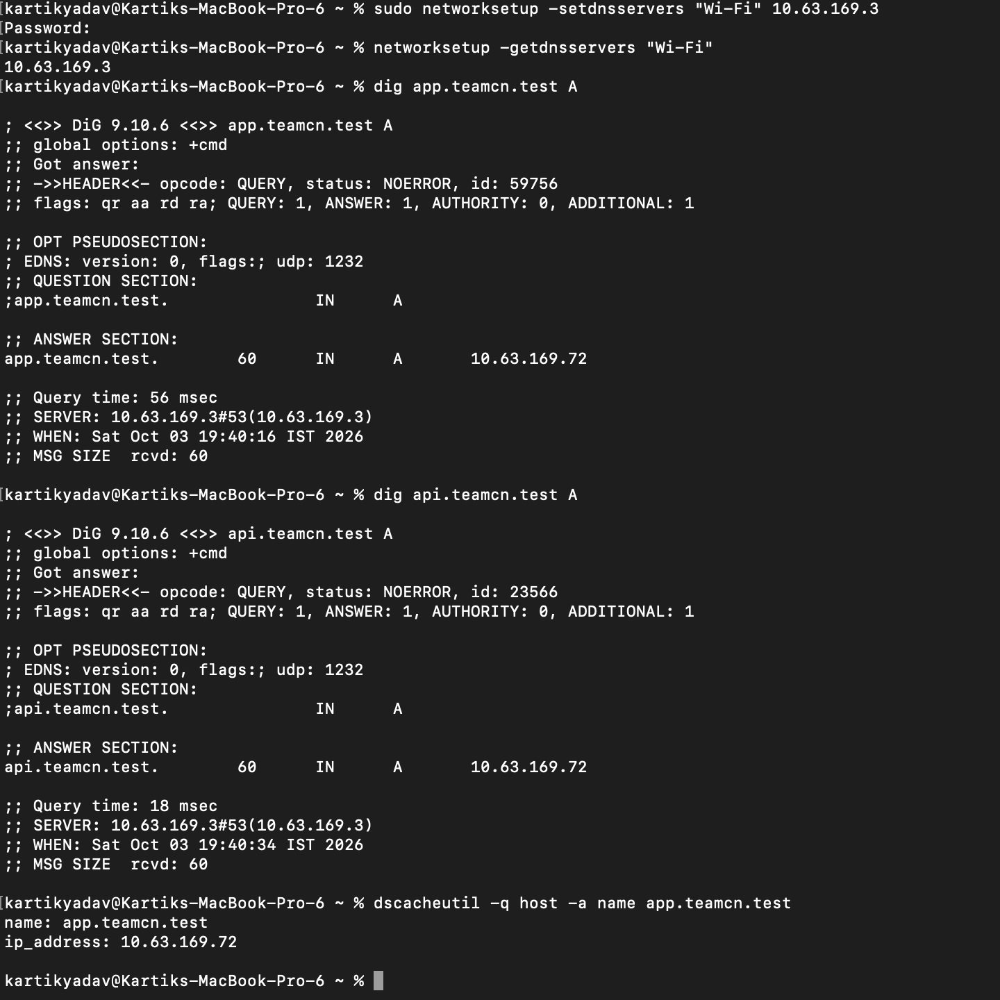
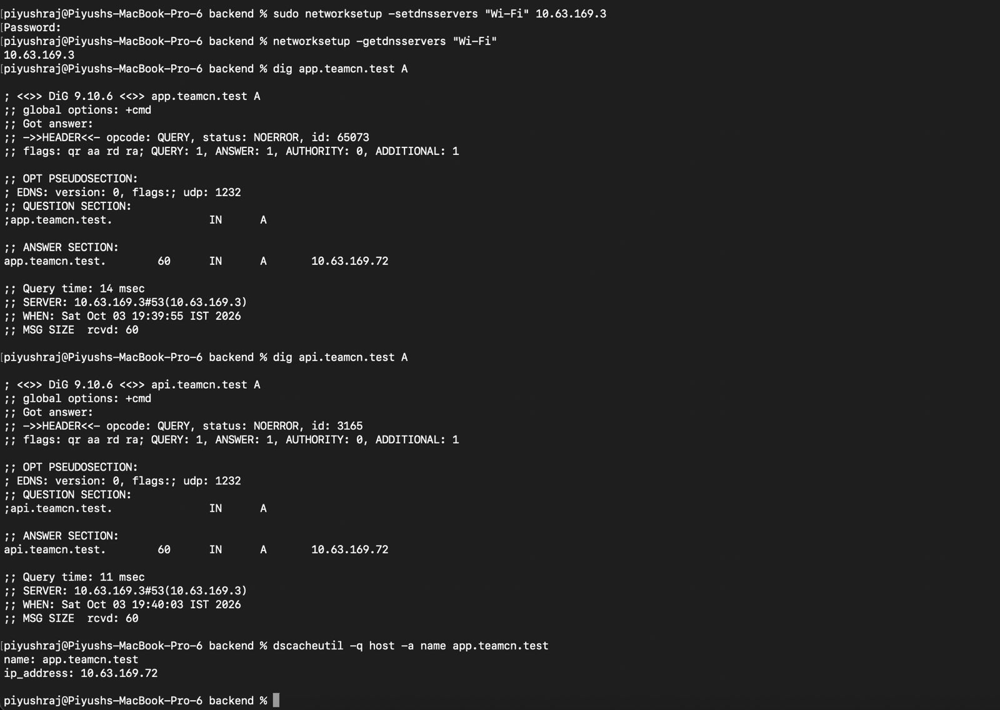
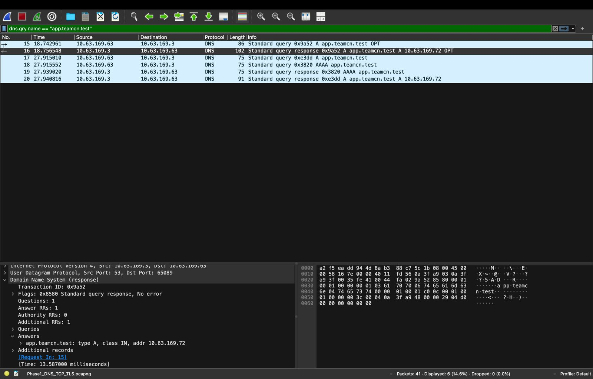
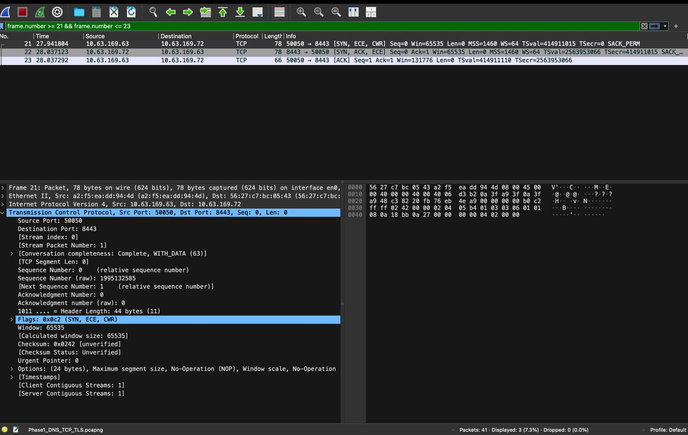
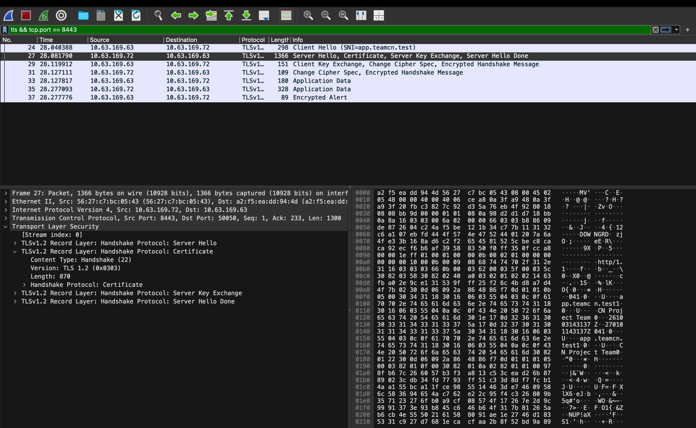
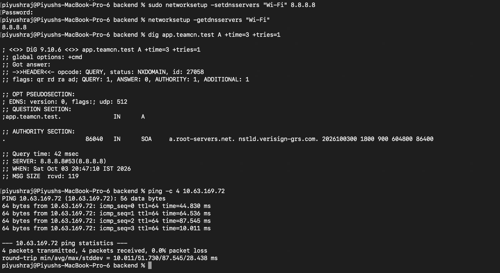
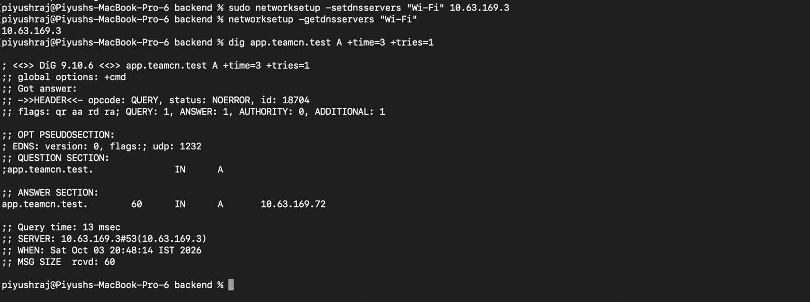

# Phase 1 Screenshot and Evidence Guide

This document explains how the project's screenshots, terminal outputs and packet capture are organised.

Evidence was collected during the Phase 1 tests on 3 October 2026. Screenshots and pasted terminal outputs are identified separately.

## 1. Evidence Location

Project evidence is stored in:

```text
evidence/
```

Screenshots are linked from the relevant setup and test documents so they appear alongside their explanations.

Keep existing filenames unchanged unless all document links are updated.

## 2. Screenshot Quality

Each screenshot should clearly show:

- The command or Wireshark display filter
- Relevant IP addresses and ports
- The response or packet details
- The result being demonstrated

Keep text readable and preserve the original image. Do not modify output values or rename a JPG file to PNG without converting it.

For additional screenshots on macOS, use:

```text
Shift + Command + 4
```

## 3. LAN Connectivity Evidence

The network inventory records each Mac's IP address, active interface, subnet and gateway.

The recorded commands were:

```bash
route -n get default
ipconfig getifaddr en0
ifconfig en0
```

Ping tests covered all three machine pairs in both directions. Every test received four replies with zero packet loss.

See:

- [LAN Ping Checks](03_Ping_Checks.md)
- [Hotspot Inventory](../evidence/05_hotspot_inventory.md)
- [Hotspot Ping Results](../evidence/06_hotspot_ping_results.md)

## 4. Private DNS Screenshots

### Kartik

Shows the configured DNS server and successful resolution of the project domains.



### Piyush

Shows the configured DNS server and successful resolution of the project domains.



Both clients used DNS server `10.63.169.3` and resolved the project domains to nginx edge IP `10.63.169.72`.

See [DNS Setup](../configs/DNS_Setup.md).

## 5. Backend and Load Balancing Evidence

Recorded backend startup outputs identify:

- Backend A on Nitin: `0.0.0.0:3001`
- Backend B on Piyush: `0.0.0.0:3002`

Direct backend tests returned HTTP 200 and the correct X-Backend identifiers.

Load balancing evidence includes six consecutive requests showing both backends. Preserve the actual response sequence rather than changing it to show ideal alternation.

See:

- [Backend Setup](../backend/README.md)
- [nginx Setup](../configs/NGINX_Setup.md)
- [Evidence Index](../evidence/INDEX.md)

## 6. HTTPS Evidence

HTTPS evidence should show:

- A project domain in the URL
- Connection to port `8443`
- TLS negotiation
- Certificate hostname matching
- Successful certificate verification
- HTTP 200

The final client tests kept certificate verification enabled.

See:

- [TLS Setup](../configs/TLS_Setup.md)
- [Client Certificate Trust](../configs/TLS_Client_Trust.md)
- [HTTPS Trust Verification](../evidence/23_https_system_trust_verified.md)

## 7. HTTP Caching Evidence

The `/api/cache` test showed:

1. An HTTP 200 response with `Cache-Control: public, max-age=60` and an ETag.
2. A request containing the matching `If-None-Match` value.
3. An HTTP 304 response with no body.

This demonstrates conditional validation. It does not establish that nginx served a proxy-cache hit.

See:

- [Caching Test](05_Caching_Test.md)
- [Recorded HTTPS Cache Test](../evidence/24_https_cache_304_verified.md)

## 8. Wireshark Screenshots

### DNS Query and Response

Shows the client query to Nitin's DNS server and the returned nginx edge IP.



### TCP Three-Way Handshake

Shows SYN, SYN-ACK and ACK between Piyush's client and Kartik's HTTPS edge.



### TLS Handshake

Shows TLS handshake messages, the server certificate and encrypted Application Data.



### Original Capture

The saved packet capture is retained alongside the screenshots:

[Phase1_DNS_TCP_TLS.pcapng](../evidence/Phase1_DNS_TCP_TLS.pcapng)

Screenshots illustrate selected packets; the original capture preserves the full recorded packet evidence.

See [Packet Capture Analysis](06_Packet_Capture.md).

## 9. Failure and Recovery Evidence

Each failure demonstration should identify:

1. The working state
2. The change that caused the failure
3. The observed result
4. The affected layer
5. The successful restoration

### Wrong Client DNS

Piyush changed the client DNS to `8.8.8.8`. The project domain returned NXDOMAIN, while ping to the edge IP still succeeded.



### DNS Restored

After restoring DNS to `10.63.169.3`, the domain resolved correctly again.



Other recorded scenarios covered a wrong destination port, one backend stopped, both backends stopped, and an incorrect DNS record.

See [Failure Demonstrations](07_Failure_Demonstrations.md).

## 10. Failure Demonstration Video

The submission form also requests a failure demonstration in the video.

For the wrong-client-DNS scenario, show this sequence:

1. Successful private DNS resolution
2. Client DNS changed to `8.8.8.8`
3. NXDOMAIN while IP ping remains successful
4. Client DNS restored to `10.63.169.3`
5. Successful private DNS resolution again

Describe the DNS-layer failure and its recovery. A screenshot slideshow should be identified as recorded evidence, rather than presented as a live command demonstration.

## 11. Evidence Index

Use the [Evidence Index](../evidence/INDEX.md) to locate the recorded outputs, screenshots and capture files.

Historical college-network results are separate from the hotspot evidence used for the final project.
