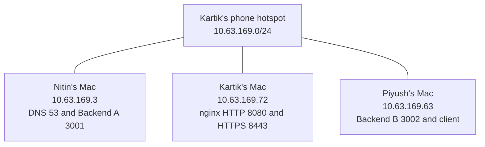
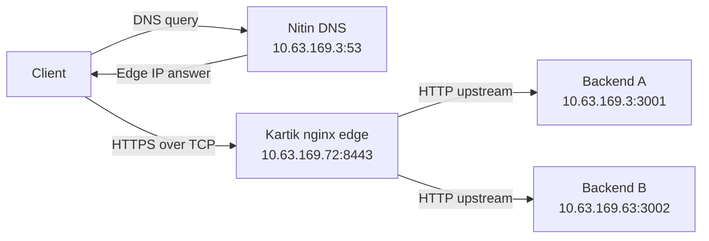

# Phase 1 Network Architecture

The project uses three physical macOS laptops with combined roles on the same Wi-Fi hotspot LAN.

Nitin runs private DNS and Backend A, Kartik runs the nginx edge, and Piyush runs Backend B and performs client tests and packet capture.

## 1. Infrastructure

- **Submission type:** Type 2 — Three Macs with combined roles
- **Network:** Kartik's phone hotspot
- **Subnet:** 10.63.169.0/24
- **Subnet mask:** 255.255.255.0
- **Gateway:** 10.63.169.210
- **Active interface:** en0 on all three Macs

The addresses below were recorded during testing on 3 October 2026. Recheck them after reconnecting to the hotspot.

## 2. Machine Inventory

| Member | OS | Private IPv4 | Interface | Roles |
|---|---|---|---|---|
| Nitin Kumar | macOS | 10.63.169.3 | en0 | Private DNS and Backend A |
| Kartik Yadav | macOS | 10.63.169.72 | en0 | nginx reverse proxy, TLS termination and load balancing |
| Piyush Yadav | macOS | 10.63.169.63 | en0 | Backend B, client tests and Wireshark capture |

### Recorded Interface MAC Addresses

| Machine | MAC Address |
|---|---|
| Nitin | 8a:b3:88:c7:5c:1b |
| Kartik | 56:27:c7:bc:05:43 |
| Piyush | a2:f5:ea:dd:94:4d |

## 3. Services and Ports

| Host | Service | Transport and Port |
|---|---|---|
| Nitin | dnsmasq private DNS | UDP/TCP 53 |
| Nitin | Python Backend A | TCP 3001 |
| Kartik | nginx HTTP edge | TCP 8080 |
| Kartik | nginx HTTPS edge | TCP 8443 |
| Piyush | Python Backend B | TCP 3002 |

The recorded DNS packet exchange used UDP. HTTPS uses TLS over TCP.

## 4. Private DNS

Project zone:

```text
teamcn.test
```

| Domain | Returned A Record |
|---|---|
| app.teamcn.test | 10.63.169.72 |
| api.teamcn.test | 10.63.169.72 |

Both names point to Kartik's nginx edge rather than directly to a backend.

Kartik and Piyush configured their Wi-Fi DNS to use `10.63.169.3`. Nitin's HTTPS test used curl's `--resolve` option without changing his system DNS.

The `teamcn` label is the domain used in the actual tests, not a claimed faculty-assigned team number.

## 5. Topology



### Logical Request Flow



DNS lookup and the HTTPS request are separate exchanges.

## 6. Request Processing

1. The client resolves `app.teamcn.test` through Nitin's private DNS.
2. DNS returns the nginx edge IP `10.63.169.72`.
3. The client establishes a TCP connection to port `8443`.
4. The client and nginx negotiate TLS and verify the server certificate.
5. The client sends its HTTP request inside the encrypted TLS connection.
6. nginx selects an upstream backend using round-robin load balancing.
7. nginx forwards the request over HTTP to Backend A or Backend B.
8. The backend returns JSON and its X-Backend identifier.
9. nginx returns the response through the client's HTTPS connection.

TLS terminates at nginx. The edge-to-backend connections use HTTP over the private LAN.

## 7. Backend Behaviour

Both backends use the same Python standard-library implementation.

| Endpoint | Behaviour |
|---|---|
| `/` | Service message, backend identifier and status |
| `/api/status` | Backend identifier and status |
| `/api/cache` | Shared cacheable JSON resource |

Responses contain `X-Backend: A` or `X-Backend: B`.

The status endpoints use `Cache-Control: no-store`. The cache endpoint uses `Cache-Control: public, max-age=60` and an ETag.

## 8. TLS and Certificate Trust

Kartik generated a self-signed RSA 2048-bit certificate with SAN entries for:

- `app.teamcn.test`
- `api.teamcn.test`

The public certificate was transferred to Nitin and Piyush. Matching SHA-256 fingerprints were verified on all three Macs before installing explicit SSL trust.

Ordinary HTTPS tests negotiated TLS 1.3 and passed certificate verification. The Wireshark demonstration deliberately selected TLS 1.2 so the certificate could be inspected without decryption.

The private key remains on Kartik's edge server.

## 9. Caching Design

Both backends return identical content and ETags for `/api/cache`.

The recorded test returned:

- HTTP 200 from Backend B with the full representation
- HTTP 304 from Backend A after a matching If-None-Match request

This demonstrates conditional validation across load-balanced backends. nginx proxy caching was not configured.

## 10. Protocol Layers

| Protocol or Mechanism | Purpose |
|---|---|
| Wi-Fi / link layer | Local network access and frame delivery |
| IP / network layer | Host addressing and packet delivery |
| UDP / transport layer | Recorded DNS query and response |
| TCP / transport layer | Connection-oriented, reliable, ordered byte delivery |
| DNS / application layer | Maps the project domain to the edge IP |
| HTTP / application layer | Requests, responses, headers and JSON resources |
| TLS above TCP | Encrypts application traffic and authenticates the server |

## 11. Verified Results

| Test | Recorded Result |
|---|---|
| LAN connectivity | All six directional ping tests: 4/4 replies, zero loss |
| Backend access | Four direct endpoint tests: HTTP 200 with correct identifiers |
| Private DNS | Both domains resolved correctly from Kartik and Piyush |
| Default client resolver | Both clients used Nitin's DNS successfully |
| External DNS forwarding | example.com queries succeeded through dnsmasq |
| HTTP load balancing | Six successful responses alternating A/B |
| HTTPS trust | Successful certificate verification on all three Macs |
| HTTPS load balancing | Six successful responses containing both backends |
| Conditional caching | HTTP 200 followed by matching HTTP 304 without a body |
| Packet capture | DNS, TCP handshake and TLS exchange verified |

The initial HTTP test included timeouts. A later test succeeded, but the original delay's cause was not conclusively established.

## 12. Failure Demonstrations

The team tested and restored:

1. Wrong client DNS
2. Wrong DNS record IP
3. Backend A stopped
4. Both backends stopped
5. Wrong destination port

The tests distinguished DNS resolution, TCP connection establishment, TLS verification and upstream application availability.

See [Failure Demonstrations](07_Failure_Demonstrations.md).

## 13. Related Documentation

- [LAN Ping Checks](03_Ping_Checks.md)
- [DNS Setup](../configs/DNS_Setup.md)
- [Backend Setup](../backend/README.md)
- [nginx Setup](../configs/NGINX_Setup.md)
- [TLS Setup](../configs/TLS_Setup.md)
- [Client Certificate Trust](../configs/TLS_Client_Trust.md)
- [Caching Test](05_Caching_Test.md)
- [Packet Capture](06_Packet_Capture.md)
- [Evidence Index](../evidence/INDEX.md)
