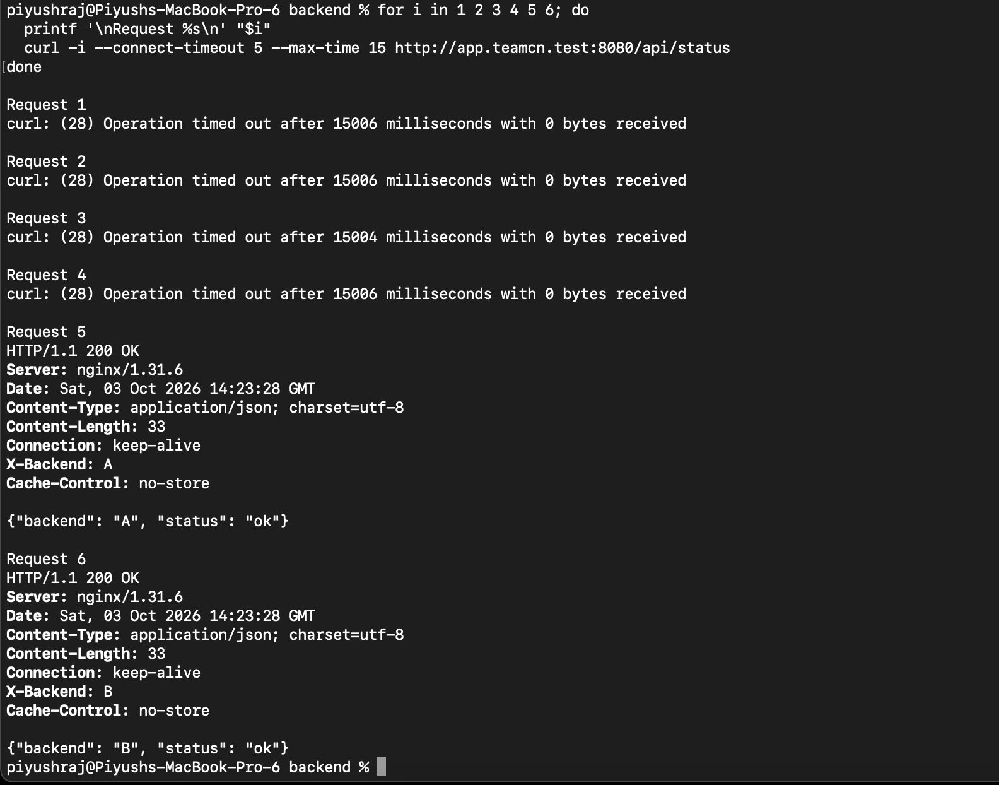

# Phase 1 — Initial HTTP Load Balancing Test

## 1. Evidence Source

This document records Piyush's terminal output and original screenshot supplied on **2026-10-03**.

The screenshot is saved as `Piyush_HTTP_load_balancing_initial.jpg`.

This is the initial HTTP test. A subsequent successful six-request test is recorded separately.

## 2. Test Command

Piyush ran six sequential requests using:

```bash
curl -i \
  --connect-timeout 5 \
  --max-time 15 \
  http://app.teamcn.test:8080/api/status
```

The requests used the project domain and nginx's HTTP listener on port **8080**.

## 3. Recorded Results

| Request | Recorded Result |
|---|---|
| 1 | curl error 28; timeout after 15006 ms; 0 bytes received |
| 2 | curl error 28; timeout after 15006 ms; 0 bytes received |
| 3 | curl error 28; timeout after 15004 ms; 0 bytes received |
| 4 | curl error 28; timeout after 15006 ms; 0 bytes received |
| 5 | HTTP/1.1 200 OK; nginx/1.31.6; X-Backend: A |
| 6 | HTTP/1.1 200 OK; nginx/1.31.6; X-Backend: B |

## 4. Successful Response Details

Both successful responses recorded:

| Field | Value |
|---|---|
| HTTP status | HTTP/1.1 200 OK |
| Server | nginx/1.31.6 |
| Response Date (UTC) | 2026-10-03 14:23:28 |
| Equivalent time (IST) | 2026-10-03 19:53:28 |
| Content type | application/json |
| Content-Length | 33 |
| Cache-Control | no-store |

The JSON bodies contained the matching backend identifier and `"status": "ok"`.

### Request 5 — Backend A

```json
{"backend": "A", "status": "ok"}
```

### Request 6 — Backend B

```json
{"backend": "B", "status": "ok"}
```

## 5. Original Screenshot



## 6. Interpretation

The two successful responses demonstrate that requests through the project domain and nginx reached both Backend A and Backend B.

However, four of the six initial requests timed out. This initial sample therefore did not demonstrate consistent successful responses across all six requests.

The timeout cause was not established. These results alone do not identify DNS, firewall or upstream connectivity as the cause.

## 7. Subsequent Verification

A later six-request HTTP test returned **HTTP 200 for every request**, with backend identifiers:

```text
A → B → A → B → A → B
```

That successful repeat is documented in [HTTP Round-Robin Verification](17_http_round_robin_verified.md).

HTTPS was subsequently configured and verified on port **8443**. The initial timeout results remain preserved here as part of the setup history.

## 8. Related Evidence

- [nginx Validation and Launch](15_nginx_validation_launch.md)
- [Successful HTTP Round-Robin Test](17_http_round_robin_verified.md)
- [Recorded Log Findings](18_log_findings.md)
- [Original nginx Logs](18_nginx_logs_openssl_original.txt)
- [HTTPS System Trust Verification](23_https_system_trust_verified.md)
- [Final Project Status](../docs/Progress.md)
