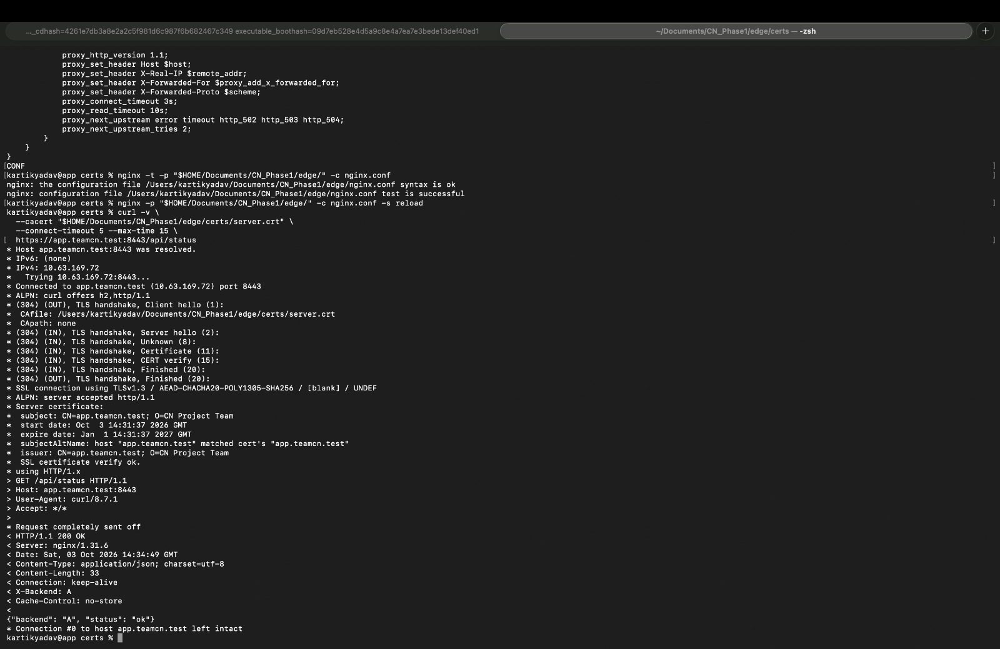

# Phase 1 — HTTPS Explicit Certificate Validation

## 1. Evidence Source

This document records Kartik's terminal output and original screenshot supplied on **2026-10-03**.

The screenshot is saved as `Kartik_HTTPS_cacert_test.jpg`.

This test used an explicit public certificate file for verification.

## 2. nginx HTTPS Configuration

The supplied output recorded that:

- nginx HTTPS configuration validation passed.
- The reload command returned without a reported error.
- The subsequent HTTPS request connected successfully to port 8443.

Related configuration: [nginx HTTPS Configuration](../configs/nginx-phase1-https.conf).

## 3. HTTPS Test Command

```bash
curl -v \
  --cacert "$HOME/Documents/CN_Phase1/edge/certs/server.crt" \
  --connect-timeout 5 \
  --max-time 15 \
  https://app.teamcn.test:8443/api/status
```

The `--cacert` option supplies the public certificate as a trust file for this request. Certificate verification remains enabled.

## 4. Recorded Connection and TLS Results

| Field | Recorded Result |
|---|---|
| Requested hostname | app.teamcn.test |
| Resolved IPv4 address | 10.63.169.72 |
| Destination port | TCP 8443 |
| Negotiated TLS version | TLSv1.3 |
| Reported cipher | AEAD-CHACHA20-POLY1305-SHA256 |
| ALPN-selected protocol | http/1.1 |
| Hostname validation | Certificate SAN matched app.teamcn.test |
| Certificate verification | SSL certificate verify ok |

## 5. Recorded HTTP Response

| Field | Recorded Value |
|---|---|
| HTTP status | HTTP/1.1 200 OK |
| Server | nginx/1.31.6 |
| X-Backend | A |
| Response Date (UTC) | 2026-10-03 14:34:49 |
| Equivalent time (IST) | 2026-10-03 20:04:49 |

Recorded JSON content:

```json
{"backend": "A", "status": "ok"}
```

## 6. Original Screenshot



## 7. Interpretation

The request successfully resolved the project hostname, connected to nginx's HTTPS listener, validated the certificate and hostname, and received an HTTP 200 response from Backend A through nginx.

This verifies HTTPS using an explicit trust file. It does not, by itself, prove that the certificate was installed in the client's system trust store.

## 8. Subsequent System Trust Verification

The public certificate was subsequently transferred to the other clients, fingerprints were compared, and client trust was configured.

Successful HTTPS requests using installed trust, without `--cacert` or `-k`, are documented in [HTTPS System Trust Verification](23_https_system_trust_verified.md).

## 9. HTTP Status Clarification

The curl TLS handshake line prefix `(304)` is not an HTTP `304 Not Modified` response.

This request returned **HTTP 200 OK**. The separate conditional caching demonstration is recorded in [HTTPS Cache 304 Verification](24_https_cache_304_verified.md).

## 10. Related Evidence

- [TLS Certificate Metadata](19_tls_certificate_metadata.md)
- [Certificate Transfer Verification](21_certificate_transfer_verified.md)
- [Client Trust Commands](22_client_trust_commands.md)
- [HTTPS System Trust Verification](23_https_system_trust_verified.md)
- [Conditional HTTP Caching](24_https_cache_304_verified.md)
- [TLS Setup Instructions](../configs/TLS_Setup.md)
