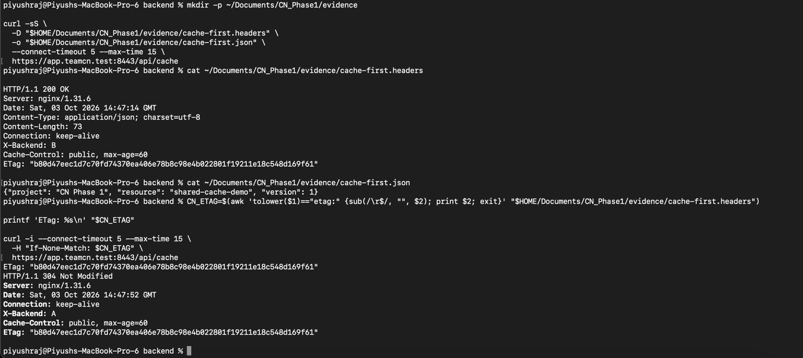

# Phase 1 — HTTPS Conditional Caching Verification

## 1. Evidence Source

This document records Piyush's supplied terminal output and original screenshot from **2026-10-03**.

The screenshot is saved as `Piyush_HTTPS_cache_304.jpg`.

The test used the caching endpoint:

```text
https://app.teamcn.test:8443/api/cache
```

## 2. Initial Request — HTTP 200

The first request returned the complete resource.

| Field | Recorded Value |
|---|---|
| HTTP status | HTTP/1.1 200 OK |
| Server | nginx/1.31.6 |
| Response Date (UTC) | 2026-10-03 14:47:14 |
| Equivalent time (IST) | 2026-10-03 20:17:14 |
| X-Backend | B |
| Cache-Control | public, max-age=60 |
| Content-Type | application/json; charset=utf-8 |
| Content-Length | 73 |

### Recorded ETag

```text
"b80d47eec1d7c70fd74370ea406e78b8c98e4b022801f19211e18c548d169f61"
```

### Recorded JSON Body

```json
{"project": "CN Phase 1", "resource": "shared-cache-demo", "version": 1}
```

## 3. Saved Initial Response Files

Piyush saved the first response headers and body locally as:

```text
~/Documents/CN_Phase1/evidence/cache-first.headers
~/Documents/CN_Phase1/evidence/cache-first.json
```

These saved files were not supplied with the evidence recorded here. The results are supported by the supplied terminal output and screenshot.

## 4. Conditional Request

The second request sent the same ETag in the `If-None-Match` header:

```bash
curl -i \
  --connect-timeout 5 \
  --max-time 15 \
  -H 'If-None-Match: "b80d47eec1d7c70fd74370ea406e78b8c98e4b022801f19211e18c548d169f61"' \
  https://app.teamcn.test:8443/api/cache
```

## 5. Conditional Response — HTTP 304

| Field | Recorded Value |
|---|---|
| HTTP status | HTTP/1.1 304 Not Modified |
| Response Date (UTC) | 2026-10-03 14:47:52 |
| Equivalent time (IST) | 2026-10-03 20:17:52 |
| X-Backend | A |
| Cache-Control | public, max-age=60 |
| ETag | Same as the initial response |
| Response body | No body |

The conditional request reached Backend A, while the initial response came from Backend B.

Both backends serve identical `/api/cache` content and generate the same ETag, allowing this cross-backend validation to succeed.

## 6. Original Screenshot



## 7. Cache-Control and ETag Interpretation

`public, max-age=60` permits storage by private and shared caches and sets a freshness lifetime of 60 seconds, subject to HTTP caching rules.

A cache can reuse a fresh stored response without contacting the server. Once the response becomes stale, it normally needs validation or a new response before reuse.

The ETag identifies the resource representation. When the client sends a matching `If-None-Match` value, the server returns **304 Not Modified** without resending the body, allowing the client to reuse its stored content.

## 8. What This Test Demonstrates

The recorded sequence was:

```text
Initial GET → HTTP 200 from Backend B with body and ETag
Conditional GET → HTTP 304 from Backend A with matching ETag and no body
```

The response timestamps are **38 seconds apart**. This was an explicit conditional request before the 60-second freshness lifetime elapsed; it does not demonstrate waiting for cache expiry.

curl does not automatically maintain a browser-style response cache. This test demonstrates conditional HTTP validation, rather than an automatic fresh browser cache hit.

## 9. Related Documents

- [Caching Test Instructions](../docs/05_Caching_Test.md)
- [Backend Source Code](../backend/server.py)
- [HTTPS System Trust Verification](23_https_system_trust_verified.md)
- [Final Project Status](../docs/Progress.md)
