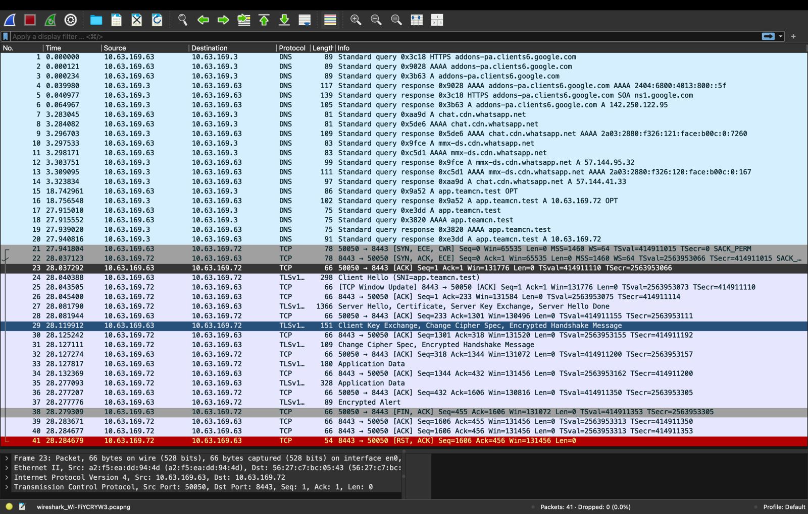

# Phase 1 — Client DNS, TCP and TLS Capture Overview

## 1. Evidence Source

The original stopped Wireshark screenshot was supplied on **2026-10-03** and saved as:

```text
Piyush_DNS_TCP_TLS_overview.jpg
```

The screenshot reported **41 packets displayed** and **0 packets dropped**.

The final saved capture was subsequently supplied and analysed:

[Download Original Capture](Phase1_DNS_TCP_TLS.pcapng)

The temporary capture filename visible in the screenshot belongs to the earlier Wireshark session.

## 2. Capture Endpoints

| Role | IPv4 Address | Port |
|---|---|---|
| Piyush — DNS client | 10.63.169.63 | UDP source port 65089 for frames 15–16 |
| Nitin — DNS server | 10.63.169.3 | UDP 53 |
| Piyush — HTTPS client | 10.63.169.63 | TCP source port 50050 |
| Kartik — nginx HTTPS server | 10.63.169.72 | TCP 8443 |

The DNS exchange and HTTPS connection use different client source ports and different server endpoints.

## 3. Original Overview Screenshot



## 4. Verified Frame Overview

| Frame(s) | Recorded Observation |
|---|---|
| 15–16 | DNS A query and response for app.teamcn.test; transaction ID 0x9a52; answer 10.63.169.72; TTL 60 |
| 17 and 20 | Another DNS A query and response for app.teamcn.test; transaction ID 0xe3dd; answer 10.63.169.72 |
| 18–19 | DNS AAAA query and response for app.teamcn.test; no IPv6 address answer |
| 21 | TCP SYN from 10.63.169.63:50050 to 10.63.169.72:8443; ECE and CWR also set |
| 22 | TCP SYN-ACK from 10.63.169.72:8443 to 10.63.169.63:50050; ECE also set |
| 23 | Client ACK completes the handshake; relative Seq=1, Ack=1 |
| 24 | TLS ClientHello with SNI app.teamcn.test |
| 27 | TLS ServerHello, Certificate, Server Key Exchange and Server Hello Done |
| 29 | Client Key Exchange, Change Cipher Spec and encrypted handshake message |
| 31 | Server Change Cipher Spec and encrypted handshake message |
| 33 and 35 | Encrypted TLS Application Data from client and server |

## 5. DNS Evidence

Frame 15 records the query:

```text
10.63.169.63:65089 → 10.63.169.3:53
A app.teamcn.test
```

Frame 16 returns:

```text
app.teamcn.test. 60 IN A 10.63.169.72
```

The response identifies Kartik's nginx address as the destination for the project hostname.

The explicit dig query and subsequent curl lookup are separate exchanges. The capture should not be described as proving that curl generated frame 15.

## 6. TCP Evidence

Frames **21, 22 and 23** record the SYN, SYN-ACK and ACK sequence between:

```text
Client: 10.63.169.63:50050
Server: 10.63.169.72:8443
```

The handshake establishes the TCP connection before TLS negotiation. TCP provides a reliable, ordered byte stream.

## 7. TLS Evidence

The analysed handshake negotiated **TLS 1.2**.

Frame 27 contains the server certificate. Its extracted SHA-256 fingerprint matches the project's public certificate.

Frames 33 and 35 contain encrypted Application Data. HTTP headers and body cannot be read directly from those TLS records without the required decryption secrets.

This capture used a separate TLS 1.2 request. The ordinary trusted HTTPS tests recorded elsewhere negotiated TLS 1.3.

## 8. Focused Screenshot Evidence

- [DNS Query and Response](Piyush_Wireshark_DNS.jpg)
- [TCP Three-Way Handshake](Piyush_Wireshark_TCP.jpg)
- [TLS Handshake and Encrypted Data](Piyush_Wireshark_TLS.jpg)

Detailed packet fields and certificate verification are recorded in [Verified Packet Analysis](27_packet_analysis_verified.md).

## 9. Display Filtering

The capture also contains unrelated DNS traffic. Display filters can focus the view without changing the original saved capture.

### Project DNS

```text
dns && dns.qry.name == "app.teamcn.test"
```

### Project TCP Connection

```text
ip.addr == 10.63.169.63 && ip.addr == 10.63.169.72 && tcp.port == 50050 && tcp.port == 8443
```

This filter includes the final ACK as well as the SYN and SYN-ACK packets.

### Project TLS Traffic

```text
tls && ip.addr == 10.63.169.72 && tcp.port == 8443
```

## 10. Related Documents

- [Original Saved Capture](Phase1_DNS_TCP_TLS.pcapng)
- [Verified Packet Analysis](27_packet_analysis_verified.md)
- [Initial TLS 1.2 Capture Attempt](25_tls12_capture_attempt.md)
- [Packet Capture Guide](../docs/06_Packet_Capture.md)
- [TLS Certificate Metadata](19_tls_certificate_metadata.md)
