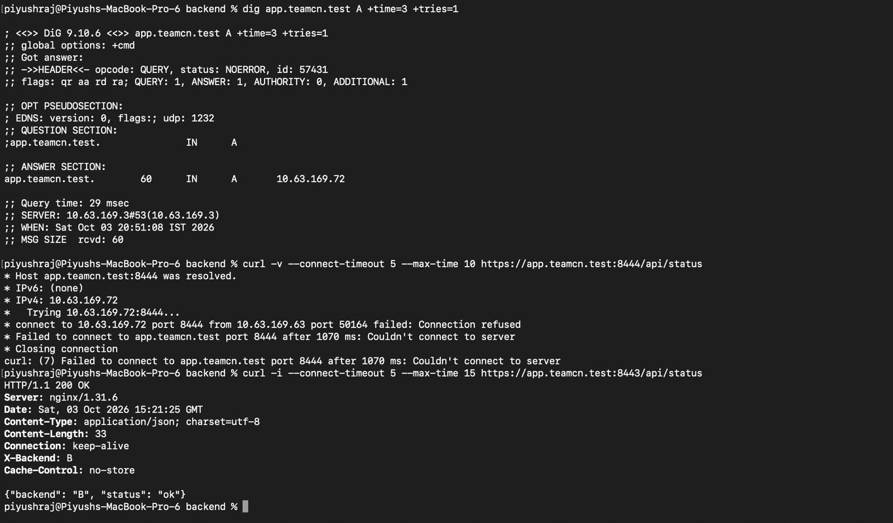

# Phase 1 — Wrong Destination Port Failure and Recovery

## 1. Evidence Source

This demonstration was performed by **Piyush** on **2026-10-03**.

The supplied terminal output and original screenshot are recorded as:

[Piyush_failure_wrong_port.jpg](Piyush_failure_wrong_port.jpg)

## 2. Before State — Working HTTPS Endpoint

The project's working HTTPS endpoint was:

```text
https://app.teamcn.test:8443/api/status
```

Earlier successful HTTPS requests are documented in [HTTPS System Trust Verification](23_https_system_trust_verified.md).

nginx serves project HTTPS on TCP port **8443**.

## 3. DNS Check

Before testing the wrong port, Piyush verified the hostname.

| Field | Recorded Value |
|---|---|
| Execution time (IST) | 2026-10-03 20:51:08 |
| Status | NOERROR |
| A answer | 10.63.169.72 |
| TTL | 60 seconds |
| DNS server | 10.63.169.3#53 |
| Query time | 29 ms |
| Query ID | 57431 |

DNS therefore returned the correct nginx host address.

## 4. Fault Introduced — Wrong Destination Port

Piyush requested the project hostname using port **8444** instead of **8443**:

```bash
curl -v \
  --connect-timeout 5 \
  --max-time 15 \
  https://app.teamcn.test:8444/api/status
```

This changed the request's destination port. No server configuration was changed.

## 5. Recorded Failure

| Field | Recorded Value |
|---|---|
| Client endpoint | 10.63.169.63:50164 |
| Destination endpoint | 10.63.169.72:8444 |
| Hostname resolution | Correct |
| Connection result | Connection refused |
| curl error | 7 |
| Reported elapsed time | Approximately 1070 ms |

The request resolved to the correct host, but a TCP connection to port **8444** could not be established.

### Original Screenshot



## 6. Layer Affected

The failure occurred at **TCP connection establishment in the transport layer**.

DNS resolution succeeded, but the destination port did not provide the project's HTTPS service. The refused connection prevented TLS negotiation and the HTTP request from proceeding.

This distinguishes a wrong-port failure from a DNS lookup failure.

## 7. Recovery — Use the Correct Port

Piyush repeated the request using port **8443**:

```bash
curl -v \
  --connect-timeout 5 \
  --max-time 15 \
  https://app.teamcn.test:8443/api/status
```

### Recorded Recovery Result

| Field | Recorded Value |
|---|---|
| HTTP status | HTTP/1.1 200 OK |
| Server | nginx/1.31.6 |
| X-Backend | B |
| Response Date (UTC) | 2026-10-03 15:21:25 |
| Equivalent time (IST) | 2026-10-03 20:51:25 |
| Certificate verification bypass | None |

Recorded JSON content:

```json
{"backend": "B", "status": "ok"}
```

Recovery required correcting the URL port. No service restart or configuration restoration was necessary.

## 8. Outcome

```text
Before: HTTPS on port 8443 works
Fault: Request targets port 8444
After: DNS succeeds, but TCP connection is refused
Recovery: Request to port 8443 returns HTTP 200 from Backend B
```

The wrong-port failure and successful correct-port recovery were verified.

## 9. Related Evidence

- [Default Client DNS Verification](13_default_dns_verified.md)
- [HTTPS System Trust Verification](23_https_system_trust_verified.md)
- [nginx HTTPS Configuration](../configs/nginx-phase1-https.conf)
- [Failure Demonstration Results](../docs/07_Failure_Demonstrations.md)
