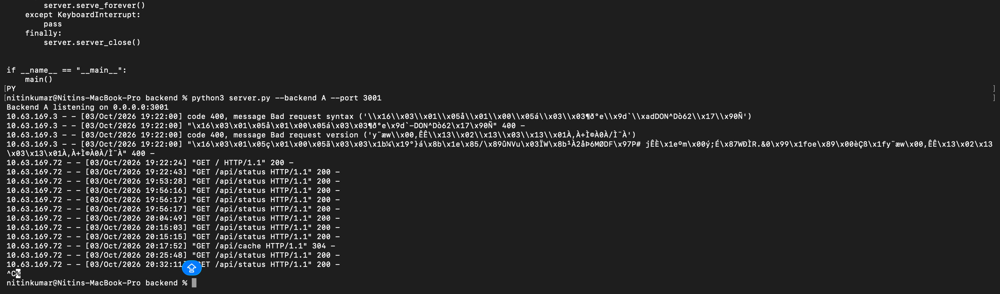
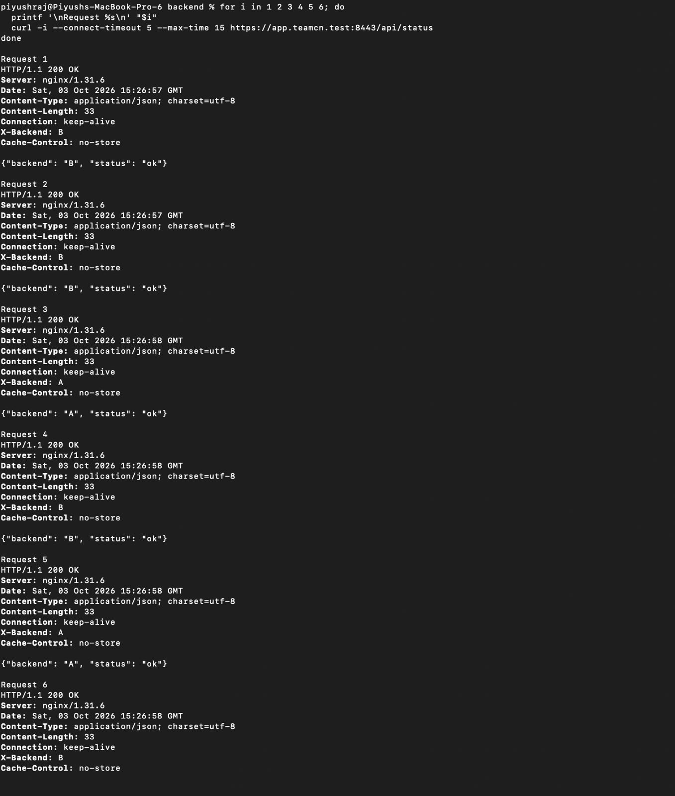

# Phase 1 — Single Backend Failure and Recovery

## 1. Evidence Source

This demonstration was performed by Nitin and Piyush on **2026-10-03**.

Evidence includes supplied terminal outputs and these original screenshots:

- Nitin_backend_A_stopped.png
- Piyush_single_backend_failover.jpg
- Piyush_backend_A_recovery.jpg

## 2. Before State — Both Backends Available

The working setup contains:

| Backend | Owner | Address |
|---|---|---|
| A | Nitin | 10.63.169.3:3001 |
| B | Piyush | 10.63.169.63:3002 |

nginx forwards requests to both backends. Earlier successful distribution is recorded in [HTTP Round-Robin Verification](17_http_round_robin_verified.md).

The failure test used:

```text
https://app.teamcn.test:8443/api/status
```

## 3. Fault Introduced — Stop Backend A

Nitin pressed **Ctrl+C** in Backend A's foreground terminal.

The supplied screenshot shows the process interruption and returned shell prompt. Nitin's separate DNS service was not reported stopped.

### Backend Stop Screenshot



## 4. After State — Service Continues Through Backend B

Piyush made six sequential HTTPS requests using:

```bash
curl -i \
  --connect-timeout 5 \
  --max-time 15 \
  https://app.teamcn.test:8443/api/status
```

### Recorded Results

| Request | HTTP Status | X-Backend |
|---|---|---|
| 1 | 200 OK | B |
| 2 | 200 OK | B |
| 3 | 200 OK | B |
| 4 | 200 OK | B |
| 5 | 200 OK | B |
| 6 | 200 OK | B |

The supplied outputs recorded:

- **Server:** nginx/1.31.6
- **Response Date:** 2026-10-03 15:24:07 UTC
- **Equivalent time:** 2026-10-03 20:54:07 IST
- **Certificate options:** Neither `-k` nor `--cacert` used

Recorded JSON content:

```json
{"backend": "B", "status": "ok"}
```

The full supplied terminal text confirms all six responses. The screenshot includes the final response details.

### Failover Screenshot


## 5. Layer and Component Affected

Stopping Backend A removed one HTTP application service from the upstream pool. Its TCP listener on port **3001** was no longer available.

nginx continued serving the recorded requests through Backend B. Successful HTTPS responses show that the client-facing service remained available during this sample.

This demonstrates failover when one backend is unavailable.

## 6. Restore Backend A

Backend A's launch command on Nitin's Mac is:

```bash
python3 server.py --backend A --port 3001
```

A separate restart-console output was not supplied. Recovery is supported by subsequent successful responses carrying `X-Backend: A`.

## 7. Recorded Recovery Results

Piyush repeated six sequential HTTPS requests.

| Request | HTTP Status | X-Backend |
|---|---|---|
| 1 | 200 OK | B |
| 2 | 200 OK | B |
| 3 | 200 OK | A |
| 4 | 200 OK | B |
| 5 | 200 OK | A |
| 6 | 200 OK | B |

Recorded response times:

```text
2026-10-03 15:26:57–15:26:58 UTC
2026-10-03 20:56:57–20:56:58 IST
```

The Backend A responses establish that A was available again, and all six recovery requests succeeded.

The first two B responses are consistent with passive failure handling and upstream re-entry, but their exact cause was not established.

### Recovery Screenshot



## 8. Outcome

```text
Before: Both backends available
Fault: Backend A stopped
After: Six HTTP 200 responses from Backend B
Recovery: Six HTTP 200 responses, including Backend A again
```

Single-backend failure and recovery were verified.

## 9. Related Evidence

- [Backend Startup](07_backend_startup.md)
- [Backend HTTP Tests](08_backend_http_tests.md)
- [HTTP Round-Robin Verification](17_http_round_robin_verified.md)
- [Both Backends Down and Recovery](31_both_backends_down.md)
- [nginx HTTPS Configuration](../configs/nginx-phase1-https.conf)
- [Failure Demonstration Results](../docs/07_Failure_Demonstrations.md)
