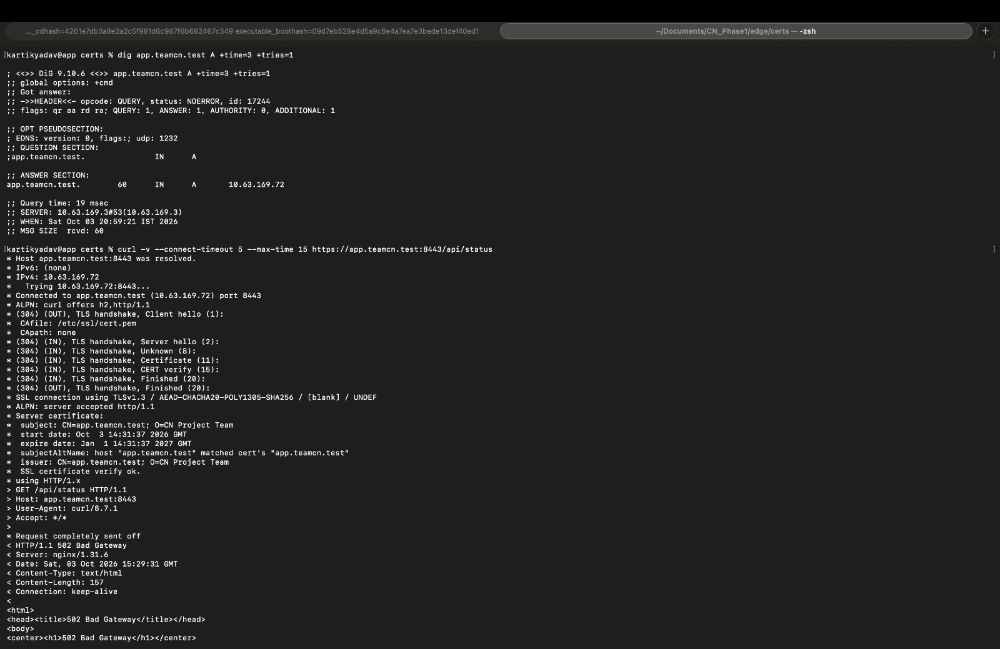
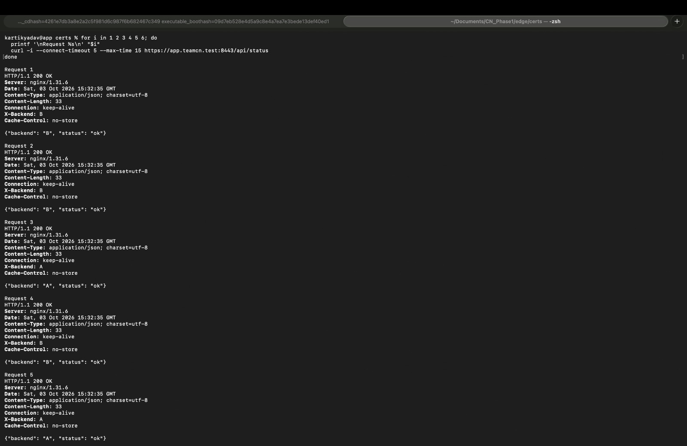
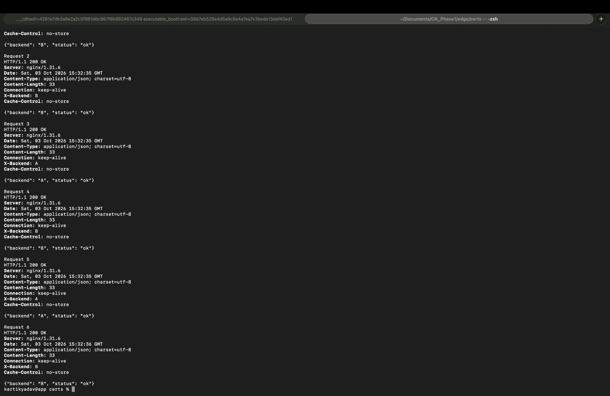

# Phase 1 — Both Backends Down and Recovery

## 1. Evidence Source

This demonstration involved Nitin and Piyush stopping their backends, followed by Kartik testing the HTTPS endpoint on **2026-10-03**.

The supplied terminal results and original screenshots are recorded as:

- Kartik_both_backends_down.jpg
- Kartik_both_backends_recovery_1.jpg
- Kartik_both_backends_recovery_2.jpg

Separate screenshots showing both backend processes being stopped were not supplied for this scenario.

## 2. Before State — Working Service

Both backends were available behind nginx:

| Backend | Owner | Address |
|---|---|---|
| A | Nitin | 10.63.169.3:3001 |
| B | Piyush | 10.63.169.63:3002 |

Successful HTTPS operation is documented in [HTTPS System Trust Verification](23_https_system_trust_verified.md).

## 3. Fault Introduced

Nitin and Piyush stopped Backend A and Backend B in their respective terminal tabs.

Nitin's DNS service and Kartik's nginx service remained running for the test.

Kartik then queried DNS and requested:

```text
https://app.teamcn.test:8443/api/status
```

## 4. DNS During the Failure

The recorded DNS lookup still succeeded:

| Field | Recorded Value |
|---|---|
| Execution time (IST) | 2026-10-03 20:59:21 |
| Status | NOERROR |
| A answer | 10.63.169.72 |
| TTL | 60 seconds |
| DNS server | 10.63.169.3#53 |
| Query time | 19 ms |
| Query ID | 17244 |

This confirms that the project hostname continued to resolve to nginx.

## 5. HTTPS During the Failure

Kartik's HTTPS request connected to nginx and completed certificate verification.

| Field | Recorded Value |
|---|---|
| Destination port | TCP 8443 |
| Negotiated TLS version | TLSv1.3 |
| Hostname validation | Certificate SAN matched |
| Certificate verification | SSL certificate verify ok |
| Trust options | Neither `-k` nor `--cacert` used |
| Server | nginx/1.31.6 |
| HTTP status | HTTP/1.1 502 Bad Gateway |
| Response body | HTML error page |
| Body length | 157 bytes |
| Response Date (UTC) | 2026-10-03 15:29:31 |
| Equivalent time (IST) | 2026-10-03 20:59:31 |

### Failure Screenshot



## 6. Layer and Component Affected

The fault removed both backend HTTP application services and their TCP listeners.

The recorded request demonstrates that:

- DNS resolution still worked.
- The client connected to nginx.
- TLS negotiation and certificate verification succeeded.
- nginx returned an HTTP 502 response because its upstream service was unavailable.

The failure therefore affected backend availability behind the reverse proxy, while the client-facing DNS and HTTPS connection remained functional.

## 7. Restore Both Backends

The backend launch commands are:

### Nitin — Backend A

```bash
python3 server.py --backend A --port 3001
```

### Piyush — Backend B

```bash
python3 server.py --backend B --port 3002
```

Run each command from the backend directory on its assigned Mac.

After the backends were restored, Kartik repeated six sequential HTTPS requests.

## 8. Recorded Recovery Results

| Request | HTTP Status | X-Backend |
|---|---|---|
| 1 | 200 OK | B |
| 2 | 200 OK | B |
| 3 | 200 OK | A |
| 4 | 200 OK | B |
| 5 | 200 OK | A |
| 6 | 200 OK | B |

Recorded response times:

```text
2026-10-03 15:32:35–15:32:36 UTC
2026-10-03 21:02:35–21:02:36 IST
```

All six requests succeeded. Responses from both A and B establish that both backends were available again.

### Recovery Screenshot 1



### Recovery Screenshot 2



## 9. Outcome

```text
Before: HTTPS service works with both backends available
Fault: Backend A and Backend B stopped
After: DNS and TLS succeed; nginx returns HTTP 502
Recovery: Six HTTP 200 responses, including both A and B
```

Both-backend failure and service restoration were verified.

## 10. Related Evidence

- [Backend Startup](07_backend_startup.md)
- [HTTPS System Trust Verification](23_https_system_trust_verified.md)
- [Single Backend Failure and Recovery](30_single_backend_failover.md)
- [nginx HTTPS Configuration](../configs/nginx-phase1-https.conf)
- [Failure Demonstration Results](../docs/07_Failure_Demonstrations.md)
